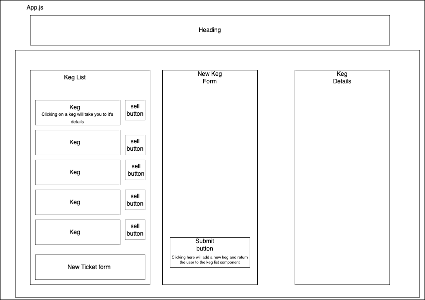

<br>
<p align="center">
  <u><big>|| <b>Tap Room</b> ||</big></u>
</p>
<p align="center">Created By: Matt Luker
</p>
<p align="center">
    <!-- Matt Avatar/Logo -->
    <a href="https://github.com/jmlden36">
        
    </a>
    <p align="center">
      ___________________________
    </p>
    <!-- GitHub Link -->
    <!-- Matt-->
    <p align="center">
        <a href="https://github.com/jmlden36">
            <strong>Matt Luker's GitHub</strong>
        </a>
    </p>
    <p align="center">
        <a href="https://www.linkedin.com/in/james-matt-luker/">
            
        </a>
    </p>         
</p>

<p align="center">
  <small>Initiated February 11th, 2022.</small>
</p>

<!-- Project Links -->
<p align="center">
    <a href="https://github.com/jmlden36/tap-room#readme"><big>Project Docs</big></a> ·
    <a href="https://github.com/jmlden36/tap-room/issues"><big>Report Bug</big></a> ·
    <a href="https://github.com/jmlden36/tap-room/issues"><big>Request Feature</big></a>
</p>
<p align="center">
___________________________
</p>

### Table of Contents
* <a href="#-about-the-project">About the Project</a>
    * <a href="#-description">Description</a>
    * <a href="#-known-bugs">Known Bugs</a>
    * <a href="#-built-with">Built With</a>
* <a href="#-getting-started">Getting Started</a>
    * <a href="#-prerequisites">Prerequisites</a>
    * <a href="#-setup-and-use">Setup and Use</a>
* <a href="#-license">License</a>
    

___________________________


## About the Project

### Tap Room Description
Tap Room is an application designed for a tap room to allow a user to create, read, update and delete kegs from the tap room keg list.  A user can also sell pints from a keg and see when it is empty and see the kegs details.  

## Component Diagram
<a>
        
    </a>


### Known Bugs

* There are no known bugs

### Built With
* [Visual Studio Code](https://code.visualstudio.com/)
* [JavaScript](https://www.javascript.com/)
* [CSS](https://developer.mozilla.org/en-US/docs/Web/CSS)
* [HTML](https://developer.mozilla.org/en-US/docs/Web/HTML)
* [React](https://reactjs.org/)
* [webpack](https://webpack.js.org/)
___________________________


## Getting Started

### Prerequisites

#### Code Editor

  To view or edit the code, you will need an code editor or text editor. I recommend VisualStudio Code.

  1) Code Editor Download:[VisualStudio Code](https://code.visualstudio.com/)
  2) Click the download most applicable to your OS and system.
  3) Wait for download to complete, then install -- Windows will run the setup exe and macOS will drag and drop into applications.
  4) Optionally, create a [GitHub Account](https://github.com)
  5) You will need VisualStudio Live Server to play this game
  6) You will need VisualStudio Code Live Share Extension in order to play with multiple users

### Setup and Use

  #### Cloning

  1) Navigate to the [tap-room repository here](https://github.com/jmlden36/tap-room).
  2) Click 'Clone or download' to reveal the HTTPS url ending with .git and the 'Download ZIP' option.
  3) Open up your system Terminal or GitBash, navigate to your desktop with the command: `cd Desktop`, or whichever location suits you best.
  4) Clone the repository to your desktop: `$ git clone https://github.com/jmlden36/tap-room`
  5) Run the command `cd tap-room` to enter into the project directory.
  6) View or Edit:
      * Code Editor - Run the command `code .` to open the project in VisualStudio Code for review and editing.
      * Text Editor - Open by double clicking on any of the files to open in a text editor.

  #### Download

  1) Navigate to the [tap-room repository here](https://github.com/jmlden36/tap-room).
  2) Click 'Clone or download' to reveal the HTTPS url ending with .git and the 'Download ZIP' option.
  3) Click 'Download ZIP' and unextract.
  4) Open by double clicking on any of the files to open in a text editor.

  #### Launch the application
  1) Make sure you have the project open in your code editor and have navigated to the project directory in your terminal
  2) In your terminal while in the project directory use the command `npm install`
  3) Next use the command npm run start to launch the application in your browser

  #### Using the application
  A user can click the `add keg` button to be directed to a form for creating a new keg and adding it to the keg list.  You can click on `view details` for each keg in the keg list to be directed to the kegs details.  While in the details page you can update or delete the selected keg.  When you click the `Sell Pint` button you will decrease the amount of pints left in the keg by 1 until you are completely sold out.  A user receives a warning message when a keg gets below 10 pints left.

### License

```
MIT License

Copyright (c) 2021 Matt Luker.

Permission is hereby granted, free of charge, to any person obtaining a copy
of this software and associated documentation files (the "Software"), to deal
in the Software without restriction, including without limitation the rights
to use, copy, modify, merge, publish, distribute, sublicense, and/or sell
copies of the Software, and to permit persons to whom the Software is
furnished to do so, subject to the following conditions:

The above copyright notice and this permission notice shall be included in all
copies or substantial portions of the Software.

THE SOFTWARE IS PROVIDED "AS IS", WITHOUT WARRANTY OF ANY KIND, EXPRESS OR
IMPLIED, INCLUDING BUT NOT LIMITED TO THE WARRANTIES OF MERCHANTABILITY,
FITNESS FOR A PARTICULAR PURPOSE AND NONINFRINGEMENT. IN NO EVENT SHALL THE
AUTHORS OR COPYRIGHT HOLDERS BE LIABLE FOR ANY CLAIM, DAMAGES OR OTHER
LIABILITY, WHETHER IN AN ACTION OF CONTRACT, TORT OR OTHERWISE, ARISING FROM,
OUT OF OR IN CONNECTION WITH THE SOFTWARE OR THE USE OR OTHER DEALINGS IN THE
SOFTWARE.
```
___________________________